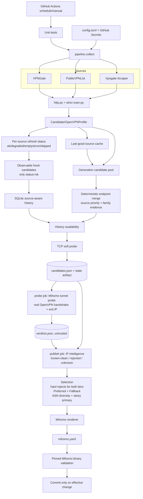

# Architecture — audited v0.3.1

## Runtime data flow



## Job boundaries

| Job | Stage (`python -m gate_us_lite <stage>`) | Trust |
|---|---|---|
| `collect` | `collect`: sources, merge, pre-rank, TCP probe; writes the candidate pool and the selector state | `PUBLICVPNLIST_API_KEY` only, read-only token |
| `probe` | `probe`: dials the pool through real tunnels; writes the verdicts | no secrets, read-only token, the only job that talks to untrusted VPN servers |
| `publish` | `finish`: intelligence, selection, render; then `mihomo -t`, commit, dist push | publishing secrets and write token; treats the verdicts as untrusted |

Exit codes of the CLI: `0` published, `2` no acceptable node (old YAML stays), `3` tunnel probe unavailable (nothing is published), `4` configuration error such as a missing `PROXYCHECK_API_KEY` (nothing is published).

## State model

```text
source_refreshes
  one row per source per run
  status = ok | degraded | empty | error | skipped

observations
  only fresh candidates from source_refreshes.status == ok

endpoint availability
  numerator   = valid observations of this endpoint
  denominator = successful observation opportunities from sources
                that have actually observed this endpoint

source_cache
  last-good recovery material; may generate Fallback candidates
  but never counts as a live observation
```

## Selection invariants

1. **Mirror provenance is not independent evidence.** Independent evidence is counted by normalized `evidence_families`, not the number of provenance labels.
2. **Merge order is deterministic.** Concurrent source completion order cannot decide the canonical profile.
3. **Unknown intelligence is not clean intelligence, and risk is never published.** Both ipwho and ProxyCheck must answer for the observed exit address (`require_known_intel`), and a ProxyCheck reply with a missing or null verdict is an error, not a clean result. Tor, proxy/VPN, residential-proxy and risk verdicts come from ProxyCheck (asked to remember detections for `proxycheck_lookback_days`); hosting and Tor can additionally be flagged by AbuseIPDB, and hosting by the ISP keyword heuristic. Unknown, hosting, proxy, Tor, residential-proxy, non-US, high-risk (`max_proxycheck_risk`) and severely abused addresses are hard rejects for Preferred and Fallback alike. Only ping, speed, availability and TCP-failure gates distinguish Preferred from Fallback.
4. **Source failure does not reduce endpoint availability.** Error, empty, degraded and skipped source runs are not valid denominator opportunities.
5. **Cached recovery is generation-only evidence.** It prevents empty output, but does not improve historical availability.
6. **Source fan-out is bounded.** Secondary profile downloads are capped by candidate count and a short per-profile timeout.
7. **Published YAML must parse in Mihomo.** CI validates the final artifact with a pinned binary and checksum.
8. **Published nodes were dialed in the same run.** A candidate that cannot complete an OpenVPN handshake and fetch the Cloudflare trace through Mihomo is dropped, and the observed exit IP replaces the endpoint IP for intelligence lookups. There is no unverified mode: if the probe harness is unavailable the run publishes nothing.
9. **The process that dials untrusted servers holds no secret and no write token.** It runs in its own job; the publishing job verifies the candidate pool and the selector state by SHA-256 before it fetches the verdicts, filters the verdicts it receives, and saves the state back to the cache only after that check passed.
10. **The YAML carries no volatile data.** No timestamps, scores or per-run comments, so the file changes only when the selected nodes change.

## Module ownership

| Module | Responsibility |
|---|---|
| `cli.py` | Argument parsing, the `collect`/`probe`/`finish`/`all` stages and the JSON hand-over between jobs |
| `pipeline.py` | Source fetching and health transitions, candidate pre-ranking, tunnel verdicts, intelligence, selection and output |
| `log.py` | Stderr progress logging |
| `sources.py` | Source adapters and bounded materialization |
| `http.py` | HTTP fetch/retry primitive: https only, redirects never carry request headers to another origin |
| `ovpn.py` | Untrusted OVPN normalization and safety boundary |
| `models.py` | Candidate/profile data contracts |
| `store.py` | SQLite history, source refresh opportunities, caches, selection state |
| `probe.py` | Lightweight TCP reachability evidence |
| `tunnel.py` | Local Mihomo process that dials each candidate through its OpenVPN tunnel and reports the exit IP or the failure reason |
| `intel.py` | IP/ASN/hosting/proxy/abuse intelligence and cache policy |
| `select.py` | Deterministic merge, scoring, Preferred/Fallback selection |
| `mihomo.py` | Mihomo OpenVPN and proxy-group renderer, plus the per-candidate probe configuration |
| workflow | `collect` (test, fetch, pool), `probe` (tunnels), `publish` (intelligence, select, real Mihomo validation, publish); `.github/actions/install-mihomo` installs the pinned binary |

## External secrets

The repository reads API keys from environment/GitHub Secrets. Keys must never be committed to `config.toml`, state DB, logs, or generated YAML.
