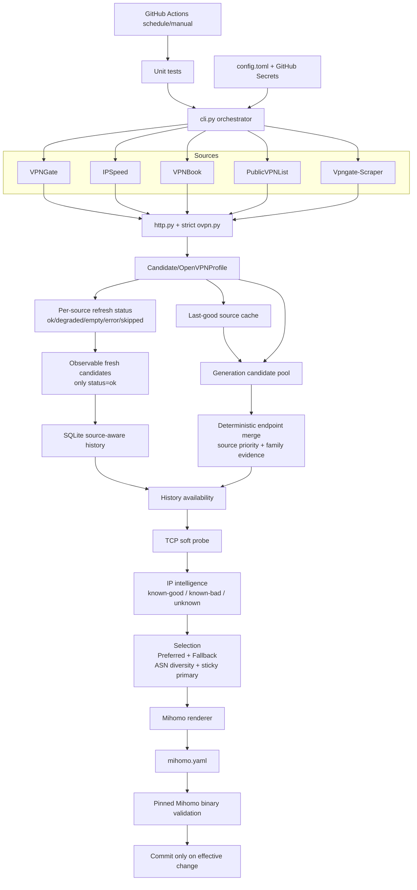

# Architecture — audited v0.3.1

## Runtime data flow



## State model

```text
source_refreshes
  one row per source per run
  status = ok | degraded | empty | error | skipped

observations
  only fresh candidates from source_refreshes.status == ok

endpoint availability
  numerator   = valid observations of this endpoint
  denominator = successful observation opportunities from sources
                that have actually observed this endpoint

source_cache
  last-good recovery material; may generate Fallback candidates
  but never counts as a live observation
```

## Selection invariants

1. **Mirror provenance is not independent evidence.** Independent evidence is counted by normalized `evidence_families`, not the number of provenance labels.
2. **Merge order is deterministic.** Concurrent source completion order cannot decide the canonical profile.
3. **Unknown intelligence is not clean intelligence.** `ipwho` must be known before a node can enter Preferred. Unknown nodes may remain in Fallback.
4. **Source failure does not reduce endpoint availability.** Error, empty, degraded and skipped source runs are not valid denominator opportunities.
5. **Cached recovery is generation-only evidence.** It prevents empty output, but does not improve historical availability.
6. **Source fan-out is bounded.** Secondary profile downloads are capped by candidate count and a short per-profile timeout.
7. **Published YAML must parse in Mihomo.** CI validates the final artifact with a pinned binary and checksum.

## Module ownership

| Module | Responsibility |
|---|---|
| `cli.py` | Pipeline orchestration and source-health transitions |
| `sources.py` | Source adapters and bounded materialization |
| `http.py` | HTTP fetch/retry primitive |
| `ovpn.py` | Untrusted OVPN normalization and safety boundary |
| `models.py` | Candidate/profile data contracts |
| `store.py` | SQLite history, source refresh opportunities, caches, selection state |
| `probe.py` | Lightweight TCP reachability evidence |
| `intel.py` | IP/ASN/hosting/proxy/abuse intelligence and cache policy |
| `select.py` | Deterministic merge, scoring, Preferred/Fallback selection |
| `mihomo.py` | Mihomo OpenVPN and proxy-group renderer |
| workflow | Test, generate, real Mihomo validation, publish |

## External secrets

The repository reads API keys from environment/GitHub Secrets. Keys must never be committed to `config.toml`, state DB, logs, or generated YAML.
